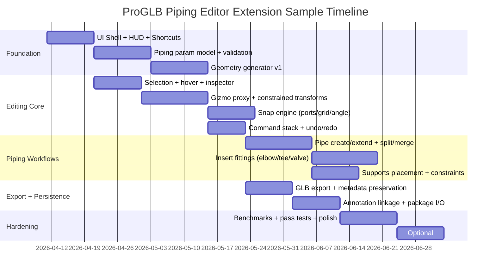

# Professional ProGLB Piping Editor Extension for a Static Web GLB Viewer

## Executive summary

This report proposes a “professional-grade” web-based extension to your ProGLB viewer that adds **piping-specific 3D editing**, a more capable **UI/layout with HUD**, **keyboard shortcuts**, **hover details**, and robust **editing workflows**—while keeping deployment **static (GitHub Pages)** and handling **GLB <50 MB** without a backend.

Key architectural decisions:

1. **Dual representation (critical):** maintain a **parametric, piping-aware model** (centerlines + fittings + connectivity graph) and generate **derived render meshes** from it. This avoids fragile vertex-level editing and makes constrained transforms, snapping, and parametric edits deterministic and undoable.

2. **Editing via tool + command system:** implement tools (select/move/rotate/pipe/fitting/support/measure) atop a **Command Stack** (undo/redo) so every edit is reversible and exportable.

3. **Constraints and snapping should be semantic-first:** prefer **snap to ports/endpoints/axes** from the parametric model; optionally add mesh snapping (BVH) for freeform collision/nearest-point queries. BVH acceleration is explicitly intended to speed up raycasting and spatial queries in three.js. citeturn9view3

4. **Export must preserve metadata intentionally:** glTF provides an `extras` mechanism for application-specific data (recommended as a JSON object for portability). citeturn7view3 Integrate with **Three.js GLTFExporter** (binary GLB mode) and ensure stable component IDs and param parameters survive round-trips. GLTFExporter supports binary export and exporter plugins. citeturn7view0

5. **Static hosting constraints matter:** GitHub Pages sites have a **1 GB published size limit**, and Git LFS **cannot be used** with GitHub Pages. citeturn9view0turn9view2 That means large sample models should be loaded locally (file input) or distributed via GitHub Releases/other hosting, not committed as LFS assets.

Scope boundaries (explicit future):
- **Multi-user collaboration, auth, permissions, server-side persistence** → future phases (backend required).
- **CAD-grade robust booleans** → optional; web CSG libraries can work but require manifold geometry and can fail numerically. citeturn3view4

## Product constraints and reference baseline

The design assumes:
- Target models are **GLB < 50 MB**
- Deployment is **static** (GitHub Pages now; optional backend later)
- The extension must behave like a professional review/edit environment (Navisworks-like UX patterns), but implemented using **Three.js controls and tooling**, including OrbitControls and TransformControls. citeturn7view2turn7view1

Practical implications:

- **Memory/disposal discipline:** Three.js GLTFLoader warns that image bitmaps are not automatically GC-collected and require explicit disposal patterns to avoid memory leaks. citeturn3view2
- **Camera/editor interaction:** OrbitControls maintains the camera “up” direction and defines standard input gestures; TransformControls is an addon intended for transforming scene objects, not the camera, and expects the controlled object to be in the scene graph. citeturn7view2turn7view1
- **Hosting limits & asset distribution:** GitHub recommends repository size discipline; it warns on files >50 MiB and blocks >100 MiB, and Pages has published size limits. citeturn9view1turn9view0

## Architecture, module breakdown, and UI layout plan

### Module relationships

```mermaid
flowchart LR
  UI[UI Shell: Panels / Toolbar / HUD] --> Tools[Tool System]
  UI --> Shortcuts[Shortcut Manager]
  UI --> Hover[Hover + Tooltip]

  Tools --> Cmd[Command Stack: Undo/Redo]
  Tools --> Sel[Selection Manager]
  Tools --> Gizmo[Gizmo Controller]
  Tools --> Snap[Snap Engine]

  Sel --> SceneIndex[Scene Index + BVH optional]
  SceneIndex --> Scene[Three.js Scene Graph]

  Tools --> Model[Piping Parametric Model]
  Model --> Gen[Geometry Generator]
  Gen --> Scene

  Import[Import Pipeline: GLB/PCF/State] --> Model
  Import --> Scene

  Export[Export Pipeline: GLB + metadata] <-- Model
  Export <-- Scene

  Ann[Annotation Store] <--> Model
  Ann <--> UI

  Persist[Persistence: localStorage/IndexedDB + package I/O] <--> Model
  Persist <--> Ann

  Debug[Debug/Telemetry Logger] --> UI
  Debug --> Tools
  Debug --> Import
  Debug --> Export
```

This composition focuses on **seams**:
- tools operate on **model**, not “random meshes”
- generator produces scene geometry deterministically
- exporter reads both scene **and** model metadata

### Required module list with responsibilities

| Module | Primary responsibility | Key outputs | Debug channels / critical logs |
|---|---|---|---|
| `ProglbPiping_UIShell` | Layout: panels + toolbar + HUD + docked debug | DOM + event wiring | `UI` (active panel/tool, focus state) |
| `ProglbPiping_ShortcutManager` | Keyboard binding, context gating (inputs vs canvas) | Shortcut events | `INPUT` (key, modifiers, action) |
| `ProglbPiping_HoverController` | Hover raycast, tooltip content/placement, throttle | Tooltip state | `HOVER` (hit, latency, id) |
| `ProglbPiping_SelectionManager` | Pick, multi-select, highlight, selection set | `SelectionSet` | `SELECTION` (picked id, count) |
| `ProglbPiping_GizmoController` | TransformControls integration, proxy object, constraints | Delta transforms → commands | `GIZMO` (mode, axis, delta) |
| `ProglbPiping_SnapEngine` | Semantic snapping (ports/axes), optional mesh snap (BVH) | Snap result | `SNAP` (candidate set, chosen, dist) |
| `ProglbPiping_CommandStack` | Undo/redo, command batching, state snapshots | Undo/redo stacks | `UNDO` (push/pop, depth, cmdId) |
| `ProglbPiping_Model` | Parametric piping components + connectivity graph | Stable data model | `MODEL` (validate, graph changes) |
| `ProglbPiping_GeometryGenerator` | Generate/update meshes per component | Meshes + metadata | `GEOM` (rebuild time, tri count) |
| `ProglbPiping_BooleanOps` (optional) | CSG cut/union for special edits | New mesh/geometry | `CSG` (op, timing, manifold checks) |
| `ProglbPiping_ImportService` | GLB import + PCF/state integration into model | Model + scene | `IMPORT` (source, timings, errors) |
| `ProglbPiping_ExportService` | GLB export + metadata preservation | GLB blob + sidecar JSON | `EXPORT` (size, ms, warnings) |
| `ProglbPiping_AnnotationService` | Pins/issues tied to `componentId`/ports | Annotation set | `ANNOT` (anchor resolution) |
| `ProglbPiping_PersistenceService` | localStorage settings + IndexedDB projects + package I/O | Saved project snapshots | `PERSIST` (read/write ms, size) |

### UI/layout mockup plan

The UI is designed for “review + edit” workflows with professional discoverability:

- **Top toolbar (horizontal):** file import/export, tool modes, snapping toggles, view alignment, section/measure toggles.
- **Left dock (vertical, tabbed):**  
  - *Model/Layers* (scene tree, pipelines, systems, isolations)  
  - *Tools* (pipe, fitting, support, cut/split, align)  
  - *Annotations* (issues list, filters, viewpoint restore)  
- **Right dock:** Property inspector (type-aware, parametric fields), plus constraints pane for the active tool.
- **Bottom dock:** Debug console (filters, perf counters, export logs).
- **HUD overlay (in-canvas):** tool state, snap state, coordinate readout, selection summary, FPS.

image_group{"layout":"carousel","aspect_ratio":"16:9","query":["three.js TransformControls gizmo screenshot","web-based 3D model viewer property inspector HUD","3D piping model viewer section box clipping plane"],"num_per_query":1}

**ASCII mockup (layout intent, not pixel-perfect):**
```text
┌────────────────────────────── TOP TOOLBAR ───────────────────────────────┐
│ Import  Export  Undo/Redo  Select Move Rotate Pipe Fitting Support Cut   │
│ Snap: On ▾  Grid 10mm  Angle 15°  Ortho/Persp  Fit  Home  Views ▾        │
└─────────────────────────────────────────────────────────────────────────┘
┌──────────── LEFT DOCK ────────────┐ ┌──────────── CANVAS ───────────────┐ ┌──── RIGHT DOCK ─────┐
│ [Model] [Tools] [Annotations]     │ │ HUD: Tool, Snap, XYZ, FPS         │ │ Properties          │
│ Model tree / Layers / Isolate     │ │ Hover tooltip near cursor         │ │ Params + Metadata   │
│ Search…                           │ │ Gizmo + snap guides               │ │ Constraints         │
└───────────────────────────────────┘ └───────────────────────────────────┘ └─────────────────────┘
┌────────────────────────────── BOTTOM DOCK ──────────────────────────────┐
│ Debug Console: filters (channel/sev), perf, export logs, copy JSON       │
└─────────────────────────────────────────────────────────────────────────┘
```

### Keyboard shortcuts table

This borrows proven DCC conventions and aligns with the official TransformControls example shortcuts where possible. citeturn10view1turn8view1

| Shortcut | Action | Context | Notes |
|---|---|---|---|
| `W` | Translate (Move tool) | Canvas | Matches TransformControls example. citeturn10view1 |
| `E` | Rotate | Canvas | Matches TransformControls example. citeturn10view1 |
| `R` | Scale (disabled for piping by default) | Canvas | Prefer parametric size edits over free scale. |
| `Q` | Toggle Local/World space | Canvas | TransformControls supports `setSpace('local'|'world')`. citeturn8view1turn8view0 |
| `Shift` (hold) | Temporary snap | Canvas | TransformControls example uses Shift for snap. citeturn10view1 |
| `X / Y / Z` | Toggle axis constraints | Canvas | Consistent with TransformControls example. citeturn10view1 |
| `Esc` | Cancel active tool / reset in-progress transform | Canvas | Mirrors “reset current transform” concept. citeturn10view1 |
| `F` | Fit to selection / model | Canvas | Should call orbit “fit to bounds” logic. citeturn7view2 |
| `H` | Home view (reset) | Canvas | Deterministic camera reset. |
| `O` | Toggle Ortho/Perspective | Canvas | Orthographic inspection is critical in piping QA. |
| `Ctrl+Z` / `Cmd+Z` | Undo | Any | Command stack. |
| `Ctrl+Shift+Z` / `Cmd+Shift+Z` | Redo | Any | Command stack. |
| `Delete` | Delete selected component(s) | Canvas | Soft-delete if needed. |
| `Ctrl+D` | Duplicate selected (component-aware) | Canvas | Duplicate parametric definition + new IDs. |
| `1` | Select tool | Canvas | Fast switching. |
| `2` | Move tool | Canvas | Fast switching. |
| `3` | Rotate tool | Canvas | Fast switching. |
| `4` | Pipe tool | Canvas | Create/extend pipes. |
| `5` | Fitting tool | Canvas | Insert elbows/tees/flanges/valves. |

### HUD fields table

| HUD field | Example | Update rate | Source |
|---|---:|---:|---|
| Active tool | `Move (Axis)` | On change | Tool controller |
| Selection | `PIPE_1023` / `3 selected` | On hover/select | Selection manager |
| Cursor world XYZ | `X=12.340 Y=5.000 Z=-0.120 m` | 10–30 Hz throttled | Hover raycast hit point |
| Pipe axis vector | `Axis=(0.00, 1.00, 0.00)` | On selection change | Parametric component data |
| Snap status | `SNAP: Port (5mm)` | On transform tick | Snap engine |
| Grid snap | `Grid 10 mm` | On toggle | Snap settings |
| Angle snap | `Angle 15°` | On toggle | Snap settings |
| Mode | `Ortho` / `Persp` | On change | Camera controller |
| FPS | `FPS 58` | 2 Hz | Perf sampler |
| Warnings | `Non-manifold candidate` | On event | CSG/validation |

## Piping component data model and parametric representation

### Why a piping-aware model is non-negotiable

A pro editor must support:
- constrained transforms “along pipe axis”
- param edits “length/diameter/bend radius”
- snapping to ports and centerlines
- component replacement (valve type swap) without mesh surgery

That is best achieved by representing piping as a **connected graph of components**, similar in spirit to BIM semantics for pipe segments and fittings: in IFC, a “pipe segment” joins sections of a piping network, and a “pipe fitting” is a junction/transition connecting segments (including elbows and junctions). citeturn12view0turn12view1

### Core data model

**Principles**
- Every component has a stable **`componentId`** (string/UUID) and a stable **type**.
- Components expose **ports** (connectors) used for snapping and connectivity.
- Geometry is generated from parameters; meshes are views.

**Type set (requested):**
- `PIPE` (straight segment)
- `ELBOW` (bend; param angle and radius)
- `TEE` (run + branch)
- `FLANGE`
- `VALVE`
- `SUPPORT`

**Param conventions (engineering-friendly)**
- store in **SI units** internally (meters, radians), convert for UI (mm, degrees).
- capture “size” as nominal + OD/ID/wall if available.
- elbow bend radius defaults can align to common long-radius elbow convention (e.g., 1.5×NPS as a typical long-radius reference). citeturn13view0

### Editable component model code snippet

```javascript id="pipe_model_core"
export const PipingType = Object.freeze({
  PIPE: 'PIPE',
  ELBOW: 'ELBOW',
  TEE: 'TEE',
  FLANGE: 'FLANGE',
  VALVE: 'VALVE',
  SUPPORT: 'SUPPORT'
});

/**
 * Port = connection point for snapping + connectivity.
 * Local frame: each component defines ports in its own local coords.
 */
export class Port {
  constructor({ id, name, position, direction }) {
    this.id = id;                 // 'A', 'B', 'RUN1', 'BRANCH', ...
    this.name = name ?? id;
    this.position = position;     // THREE.Vector3 (local)
    this.direction = direction;   // THREE.Vector3 unit (local outward direction)
  }
}

export class PipingComponent {
  constructor({ componentId, type, params, meta }) {
    this.componentId = componentId;        // stable ID
    this.type = type;                      // PipingType.*
    this.params = structuredClone(params); // parametric definition
    this.meta = { ...(meta ?? {}) };       // pipelineRef, spec, tag, etc.

    // World transform for placement; generator uses this to place geometry.
    this.transform = {
      position: { x: 0, y: 0, z: 0 },
      quaternion: { x: 0, y: 0, z: 0, w: 1 }
    };

    this.ports = [];                       // populated by subtype logic
  }

  /** Validate parameters before committing (used by property inspector + commands). */
  validate() {
    const errs = [];
    if (!this.componentId) errs.push('componentId required');
    if (!this.type) errs.push('type required');
    return errs;
  }

  /** Subtypes override: derive ports based on params (e.g., pipe length). */
  computePorts() {
    throw new Error(`${this.type}.computePorts() not implemented`);
  }
}
```

### Parametric definitions for each component type

A pragmatic v1 schema (extendable later):

- **PIPE params**
  - `length` (m)
  - `outerDiameter` (m)
  - `wallThickness` (m)
  - `axis` (unit vec local, default +X)
- **ELBOW params**
  - `angle` (rad) e.g. π/2
  - `bendRadius` (m) (centerline radius)
  - `outerDiameter`, `wallThickness`
- **TEE params**
  - `runLength`, `branchLength`
  - `runOD`, `branchOD` (or inherit)
- **FLANGE params**
  - `rating`, `faceType`, `thickness`
- **VALVE params**
  - `valveType`, `length`, `handwheel` (optional), `tagNo`
- **SUPPORT params**
  - `supportType`, `basePoint`, `direction`, `offset`, `attachToComponentId`

**Connectivity graph**
- `connections: Map<portRef, portRef>`
- each portRef is `{ componentId, portId }`

This enables:
- “snap branch to run”
- “split pipe at station”
- “insert elbow and auto-trim adjacent pipe segments”

## Editing engine and critical Three.js coding requirements

### Selection and hover foundations

**Picking**
- Use `THREE.Raycaster` against an interactable list or scene subtree.
- Consider BVH acceleration for complex geometries (optional but recommended) to keep hover and selection responsive. BVH is explicitly used to speed raycasting and spatial queries. citeturn9view3

**Hover tooltip behavior**
- trigger after **~100–150 ms** hover dwell
- update at **≤ 15 Hz** (throttle) to avoid UI churn
- hide immediately on pointer leave or camera drag
- allow “pin tooltip” on `Alt+Click`

Tooltip data should show (minimal, stable identifiers first):
- `Type`, `componentId`, `RefNo/Tag`, `Pipeline`, `Size (OD/Sch)`, `Status` (if any)
- “edit affordance”: e.g., “Press E to rotate around axis”

### Selection code snippet

```javascript id="selection_manager"
export function createSelectionManager({ camera, domElement, scene, raycaster, logger }) {
  const selectedIds = new Set();
  const mouseNdc = new THREE.Vector2();
  const pickables = new Set(); // meshes with userData.componentId

  function registerPickable(mesh) { pickables.add(mesh); }
  function unregisterPickable(mesh) { pickables.delete(mesh); }

  function _setMouseFromEvent(e) {
    const rect = domElement.getBoundingClientRect();
    mouseNdc.x = ((e.clientX - rect.left) / rect.width) * 2 - 1;
    mouseNdc.y = -(((e.clientY - rect.top) / rect.height) * 2 - 1);
  }

  function pickSingle(e, { additive = false } = {}) {
    _setMouseFromEvent(e);
    raycaster.setFromCamera(mouseNdc, camera);

    const hits = raycaster.intersectObjects([...pickables], true);
    const hit = hits.find(h => h.object?.userData?.componentId);
    if (!hit) {
      if (!additive) selectedIds.clear();
      logger?.debug('SELECTION', 'pick:none', { additive });
      return { changed: true, selectedIds: [...selectedIds] };
    }

    const cid = hit.object.userData.componentId;
    if (!additive) selectedIds.clear();
    if (additive && selectedIds.has(cid)) selectedIds.delete(cid);
    else selectedIds.add(cid);

    logger?.info('SELECTION', 'pick:hit', {
      componentId: cid,
      point: { x: hit.point.x, y: hit.point.y, z: hit.point.z }
    });

    return { changed: true, selectedIds: [...selectedIds], hit };
  }

  return { registerPickable, unregisterPickable, pickSingle, selectedIds };
}
```

### Transform gizmos and constrained transforms

#### Why TransformControls + proxy object

TransformControls:
- supports translate/rotate/scale modes and snapping increments. citeturn8view1turn8view0
- provides events like `mouseDown`, `mouseUp`, `change`, `objectChange`. citeturn8view1
- expects the attached object to be in the scene graph. citeturn7view1

However, piping edits should update **parametric model state**, not permanently “free-transform meshes”. The robust pattern is:

1. attach TransformControls to a **proxy Object3D** (the “gizmo proxy”)
2. on drag, compute a delta transform
3. apply a **command** to update the parametric component (or connectivity) using constraints and snapping
4. regenerate geometry and reset proxy to the new canonical transform

#### Gizmo wiring snippet

```javascript id="gizmo_controller"
import { TransformControls } from 'three/addons/controls/TransformControls.js';

export function createGizmoController({ camera, domElement, scene, orbitControls, logger }) {
  const tc = new TransformControls(camera, domElement);
  tc.setSpace('local'); // axis-aligned editing for pipe-axis constraints
  scene.add(tc);

  const proxy = new THREE.Object3D();
  proxy.name = 'PROGLB_GIZMO_PROXY';
  scene.add(proxy);

  let activeComponentId = null;
  let dragStart = null;

  tc.addEventListener('mouseDown', () => {
    orbitControls.enabled = false;
    dragStart = {
      position: proxy.position.clone(),
      quaternion: proxy.quaternion.clone()
    };
    logger?.debug('GIZMO', 'drag:start', { componentId: activeComponentId });
  });

  tc.addEventListener('mouseUp', () => {
    orbitControls.enabled = true;
    logger?.debug('GIZMO', 'drag:end', { componentId: activeComponentId });
    dragStart = null;
  });

  tc.addEventListener('change', () => {
    // Do NOT apply model updates on every change unless throttled;
    // prefer tc "objectChange" if you need object-only deltas.
  });

  function attachToComponent({ componentId, worldPosition, worldQuaternion }) {
    activeComponentId = componentId;
    proxy.position.copy(worldPosition);
    proxy.quaternion.copy(worldQuaternion);

    tc.attach(proxy);
    logger?.info('GIZMO', 'attach', { componentId });
  }

  function detach() {
    tc.detach();
    activeComponentId = null;
    dragStart = null;
  }

  function setMode(mode) { tc.setMode(mode); } // 'translate' | 'rotate' | 'scale'  citeturn8view1
  function setSnaps({ translationSnap, rotationSnap }) {
    tc.setTranslationSnap(translationSnap ?? null); // citeturn8view1
    tc.setRotationSnap(rotationSnap ?? null);       // citeturn8view1
  }

  return { tc, proxy, attachToComponent, detach, setMode, setSnaps, getActiveId: () => activeComponentId, getDragStart: () => dragStart };
}
```

#### Constrained move along pipe axis (semantic constraint)

Technique:
- define component local +X axis = pipe axis
- keep TransformControls in `local` space
- allow only `X` axis editing (or implement custom projection)

If you want a “hard” axis constraint even when the user drags off-axis, apply projection:

```javascript id="constrained_translate_axis"
export function projectTranslationDeltaOntoAxis({ startPos, currentPos, axisUnitWorld }) {
  const delta = currentPos.clone().sub(startPos);
  const d = delta.dot(axisUnitWorld); // scalar distance along axis
  return axisUnitWorld.clone().multiplyScalar(d);
}
```

**Workflow**
- compute `axisUnitWorld` from the selected component’s transform and its canonical axis (+X)
- when tc changes, compute projected delta and apply a command “MoveAlongAxis(componentId, deltaMeters)”
- reset proxy to canonical pose after command finalizes (or every throttled tick)

#### Constrained rotate around pipe axis

Because TransformControls rotates around local axes, if local X is aligned to pipe axis, rotation around X becomes “rotate around pipe axis”. TransformControls supports rotation snapping increments. citeturn8view0turn8view1

### Snapping design

**Semantic snapping (primary)**
- ports (pipe endpoints, tee run ports, branch port)
- centerline intersection points
- known support points
- grid planes / orthographic increments

**Mesh snapping (optional, secondary)**
- nearest point on mesh surface/edge
- collision-aware placement

BVH-based acceleration can support nearest-point queries more efficiently for complex meshes, and is commonly used to speed raycasting against high-poly geometry. citeturn9view3

#### Snap engine snippet (semantic snap)

```javascript id="snap_engine_semantic"
export function createSnapEngine({ model, logger }) {
  const settings = {
    enabled: true,
    snapDistanceWorld: 0.01, // 1 cm in world units (tune per units)
    gridStep: 0.01,
    angleStepRad: THREE.MathUtils.degToRad(15)
  };

  function getSnapCandidatesNear(pointWorld, { max = 50 } = {}) {
    // Candidate set = all ports (or ports in nearby spatial bins if indexed)
    const candidates = [];
    for (const comp of model.components.values()) {
      for (const port of comp.ports) {
        const portWorld = model.portWorldPosition(comp.componentId, port.id);
        candidates.push({ kind: 'PORT', componentId: comp.componentId, portId: port.id, point: portWorld });
      }
    }
    // Sort by distance (cap for performance)
    candidates.sort((a, b) => a.point.distanceTo(pointWorld) - b.point.distanceTo(pointWorld));
    return candidates.slice(0, max);
  }

  function snapPoint(pointWorld) {
    if (!settings.enabled) return { snapped: false, point: pointWorld };

    const cands = getSnapCandidatesNear(pointWorld, { max: 30 });
    const best = cands[0];
    if (!best) return { snapped: false, point: pointWorld };

    const dist = best.point.distanceTo(pointWorld);
    if (dist <= settings.snapDistanceWorld) {
      logger?.debug('SNAP', 'snap:port', { componentId: best.componentId, portId: best.portId, dist });
      return { snapped: true, point: best.point, hit: best };
    }

    return { snapped: false, point: pointWorld };
  }

  return { settings, snapPoint };
}
```

### Parametric pipe editing: length, diameter, bend radius

Parametric edits should:
- be performed in the property inspector (exact values)
- optionally be performed interactively via gizmo (coarse)
- always validate and regenerate deterministically

#### Param edit command snippet

```javascript id="parametric_edit_command"
export class EditParamsCommand {
  constructor({ model, componentId, patch, logger }) {
    this.model = model;
    this.componentId = componentId;
    this.patch = patch;
    this.logger = logger;
    this.before = null;
  }
  do() {
    const c = this.model.components.get(this.componentId);
    this.before = structuredClone(c.params);
    Object.assign(c.params, this.patch);
    const errs = c.validate();
    if (errs.length) throw new Error(`Param validation failed: ${errs.join(', ')}`);
    c.computePorts();
    this.model.invalidateGeometry(this.componentId);

    this.logger?.info('UNDO', 'cmd:EditParams:do', { componentId: this.componentId, patch: this.patch });
  }
  undo() {
    const c = this.model.components.get(this.componentId);
    c.params = structuredClone(this.before);
    c.computePorts();
    this.model.invalidateGeometry(this.componentId);

    this.logger?.info('UNDO', 'cmd:EditParams:undo', { componentId: this.componentId });
  }
}
```

### Undo/redo (command stack)

A command stack is required for professional editing workflows. The stack must support:
- single commands
- grouped commands (e.g., “Insert tee” triggers split pipe + add tee + connect)
- coalescing (dragging generates many ticks → finalize as one command)

```javascript id="command_stack"
export function createCommandStack(logger) {
  const undo = [];
  const redo = [];

  function exec(cmd) {
    cmd.do();
    undo.push(cmd);
    redo.length = 0;
    logger?.debug('UNDO', 'stack:exec', { undoDepth: undo.length, redoDepth: redo.length, cmd: cmd.constructor.name });
  }
  function canUndo() { return undo.length > 0; }
  function canRedo() { return redo.length > 0; }

  function undo1() {
    const cmd = undo.pop();
    if (!cmd) return;
    cmd.undo();
    redo.push(cmd);
    logger?.debug('UNDO', 'stack:undo', { undoDepth: undo.length, redoDepth: redo.length, cmd: cmd.constructor.name });
  }
  function redo1() {
    const cmd = redo.pop();
    if (!cmd) return;
    cmd.do();
    undo.push(cmd);
    logger?.debug('UNDO', 'stack:redo', { undoDepth: undo.length, redoDepth: redo.length, cmd: cmd.constructor.name });
  }

  return { exec, undo: undo1, redo: redo1, canUndo, canRedo };
}
```

### Boolean/merge operations and tradeoffs

#### Preferred approach: parametric “merge/split/connect” (piping-aware)

For piping editing, most “boolean-like” outcomes are better expressed as:
- **split pipe at station** (creates two pipes + new ports)
- **merge collinear pipes** (if same OD/spec and aligned)
- **insert fitting** (trim adjacent components)

This avoids mesh CSG and preserves semantic metadata.

#### Optional mesh CSG (advanced)

If you must do mesh-level booleans (e.g., cut inspection hole, subtract clearance volumes), use an accelerated CSG library like `three-bvh-csg`, which is explicitly built atop `three-mesh-bvh` and advertises high performance in complex cases, but warns about manifold requirements and numerical corner cases. citeturn3view4turn9view3

```javascript id="csg_optional"
import { Brush, Evaluator, ADDITION, SUBTRACTION } from 'three-bvh-csg';

export function subtractMesh({ aMesh, bMesh, logger }) {
  // WARNING: CSG requires watertight/two-manifold inputs for reliable results. citeturn3view4
  const evalr = new Evaluator();

  const a = new Brush(aMesh.geometry, aMesh.material);
  a.position.copy(aMesh.position); a.quaternion.copy(aMesh.quaternion); a.updateMatrixWorld(true);

  const b = new Brush(bMesh.geometry, bMesh.material);
  b.position.copy(bMesh.position); b.quaternion.copy(bMesh.quaternion); b.updateMatrixWorld(true);

  const t0 = performance.now();
  const result = evalr.evaluate(a, b, SUBTRACTION);
  const ms = performance.now() - t0;

  logger?.info('CSG', 'csg:subtraction', { ms, aTris: a.geometry.index.count / 3, bTris: b.geometry.index.count / 3 });
  return result; // THREE.Mesh
}
```

#### Merge operations for performance/export

For reducing draw calls, you may merge BufferGeometries when compatible; Three.js provides `BufferGeometryUtils.mergeGeometries()` and documents that geometries must have compatible attributes. citeturn3view3

```javascript id="merge_geometries"
import { mergeGeometries } from 'three/addons/utils/BufferGeometryUtils.js';

export function mergeByMaterial(meshes) {
  const geoms = meshes.map(m => {
    const g = m.geometry.clone();
    g.applyMatrix4(m.matrixWorld);
    return g;
  });

  const merged = mergeGeometries(geoms, false); // citeturn3view3
  if (!merged) throw new Error('mergeGeometries failed (attribute mismatch)');
  merged.computeBoundingBox();
  merged.computeBoundingSphere();
  return merged;
}
```

## Import/export integration, annotation linkage, persistence, and debug logging

### Import integration

**GLB import** uses GLTFLoader. It is an official glTF 2.0 loader and lists supported extensions; it also warns about bitmap disposal responsibilities (important for repeated load/edit/export cycles). citeturn3view2

**Round-trip editability requirement (recommended):**
- if you import an arbitrary GLB without ProGLB piping metadata, treat it as **non-parametric** (limited editing)
- if the GLB includes ProGLB metadata in `extras`, reconstruct the parametric model

glTF supports application-specific data via `extras` and recommends `extras` be a JSON object for portability. citeturn7view3

Additionally, a recognized three.js practice is: **GLTFLoader populates `.userData` from glTF `.extras`** (meshes/materials). citeturn11view0  
This enables storing `componentId`, `type`, and `params` in glTF extras and accessing them in runtime via `object.userData`.

### Export integration

Use `GLTFExporter` with:
- `binary: true` to produce `.glb`
- `onlyVisible: true` to exclude hidden helper layers by default
- `trs` depending on whether you want `matrix` or `TRS` decomposition
- exporter plugin (`register()`) if you need to inject extras or custom extension content beyond defaults
- `includeCustomExtensions` if you store extension payloads under `userData.gltfExtensions` citeturn7view0

```javascript id="gltf_export_with_metadata"
import { GLTFExporter } from 'three/addons/exporters/GLTFExporter.js';

/**
 * Export scene to GLB, ensuring editor-only helpers are hidden and
 * piping metadata is attached via userData/extras.
 */
export async function exportGlb({ sceneRoot, logger }) {
  const exporter = new GLTFExporter(); // citeturn7view0

  // Optional: plugin injection point for custom extras handling. citeturn7view0
  exporter.register((writer) => ({
    beforeParse(input) {
      logger?.debug('EXPORT', 'export:beforeParse', { inputType: typeof input });
    }
  }));

  // Hide transient helpers; rely on onlyVisible.
  sceneRoot.traverse((o) => {
    if (o.userData?.proglbTransient) o.visible = false;
  });

  const t0 = performance.now();

  return await new Promise((resolve, reject) => {
    exporter.parse(
      sceneRoot,
      (result) => {
        const ms = performance.now() - t0;
        logger?.info('EXPORT', 'export:done', { ms, binary: true });
        resolve(new Blob([result], { type: 'model/gltf-binary' }));
      },
      (err) => {
        logger?.error('EXPORT', 'export:error', { message: err?.message ?? String(err) });
        reject(err);
      },
      {
        binary: true,         // citeturn7view0
        onlyVisible: true,    // citeturn7view0
        includeCustomExtensions: true // citeturn7view0
      }
    );
  });
}
```

**Known exporter risk (file size regression):** exporting a GLB may inflate texture sizes (e.g., JPEG → PNG) depending on pipeline; this has been observed and discussed in the three.js issue tracker. citeturn5view10  
Mitigation: preserve original textures when possible, avoid re-encoding, and/or keep textures external if you export `.gltf` for internal workflows.

### Annotation linkage

Your annotation system should anchor to:
- `componentId`
- optionally `portId` (for “issue at this nozzle/end”)
- optionally `station` along a pipe (0–1 normalized)

When edits occur:
- **split pipe:** annotations on pipe can be redistributed by station (e.g., station < split goes to segment A)
- **merge pipes:** annotations unify under new component, preserving old refs in audit trail
- **replace valve:** carry annotations by `componentId` (if you keep the same ID) or remap via explicit “replacement map”

### Persistence without backend

Because the app is static, persistence should be layered:

1. **localStorage:** UI settings, shortcuts config, last-opened project pointer (small).
2. **IndexedDB (recommended):** project saves containing:
   - parametric model JSON
   - annotations JSON
   - optional embedded GLB blobs (but be mindful of browser storage limits)
3. **Project package I/O (professional UX):** Export/Import `.zip` package:
   - `model.glb`
   - `piping-model.json` (parametric truth)
   - `annotations.json`
   - `manifest.json` (versions, units, checksum)

GitHub Pages constraints motivate local file-based workflows and downloadable packages rather than hosting large datasets in-repo. citeturn9view0turn9view2turn9view1

### Debug/logging hooks and payload examples

A professional editor needs:
- channel filtering (IMPORT/EXPORT/SELECTION/GIZMO/SNAP/MODEL/GEOM/UNDO/PERF)
- structured JSON payloads
- timing, counts, and identifiers in every command

**Example log payloads (recommended conventions):**
- `cmdId`, `sessionId`, `componentId`, `tool`, `ms`, `triangles`, `memoryMB`, `undoDepth`

```javascript id="logger_payload_examples"
logger.info('UNDO', 'cmd:MoveAlongAxis:commit', {
  cmdId: 'cmd_98c2',
  componentId: 'PIPE_1023',
  axis: { x: 1, y: 0, z: 0 },
  deltaM: 0.125,
  snapped: true,
  snap: { kind: 'PORT', targetComponentId: 'ELBOW_77', portId: 'A', distM: 0.003 },
  ms: 14.2,
  undoDepth: 12
});

logger.debug('GEOM', 'rebuild:component', {
  componentId: 'PIPE_1023',
  type: 'PIPE',
  triangles: 384,
  ms: 6.1
});

logger.warn('CSG', 'nonManifoldInputRisk', {
  componentId: 'VALVE_12',
  note: 'CSG reliability requires watertight/two-manifold inputs',
});
```

## Quantitative benchmarks, pass tests, and sample timeline

### Quantitative benchmark targets

These are recommended targets for the **<50 MB GLB** scenario on a typical modern laptop/browser (WebGL):

- **Viewer idle FPS:** ≥ 55 FPS
- **Continuous orbit FPS:** ≥ 45 FPS (with HUD + hover)
- **Hover response latency (tooltip-ready):** ≤ 120 ms (median), ≤ 250 ms (p95)
- **Selection click-to-highlight:** ≤ 80 ms (median)
- **Transform tick-to-visual update:** ≤ 50 ms (median)
- **Command commit time (move/rotate single component):** ≤ 30 ms
- **Regenerate geometry (single component):** ≤ 20 ms for typical pipes/fittings
- **Export GLB time:** ≤ 6 s (full scene), ≤ 2 s (selection only)
- **Undo/redo latency:** ≤ 80 ms for common commands

BVH acceleration is recommended if hover/selection becomes expensive on complex meshes. citeturn9view3

### Pass-test matrix table

| Test ID | Category | What it validates | Target | Measurement method |
|---|---|---|---:|---|
| PT-UI-01 | UX | Toolbar tool-switch discoverability | ≤ 1 click | Manual |
| PT-UI-02 | UX | Property inspector updates | 10/10 success | Manual |
| PT-HOV-01 | Hover | Tooltip appears after dwell | 100–150 ms delay | Timer |
| PT-HOV-02 | Hover | Tooltip never blocks orbit | 10/10 | Manual |
| PT-SEL-01 | Selection | Click selects correct component | 19/20 | Manual |
| PT-SEL-02 | Selection | Multi-select toggle works | 10/10 | Manual |
| PT-GIZ-01 | Gizmo | TransformControls attach/detach stable | 20/20 | Manual |
| PT-GIZ-02 | Gizmo | Orbit disabled while dragging | 10/10 | Manual + event log citeturn8view1 |
| PT-CON-01 | Constraint | Move along pipe axis only | 10/10 | Compare delta projection |
| PT-CON-02 | Constraint | Rotate around pipe axis only | 10/10 | Compare axis-angle |
| PT-SNAP-01 | Snap | Snap to port within threshold | 18/20 | Manual + logs |
| PT-SNAP-02 | Snap | Grid snap increments correct | 10/10 | Numeric check |
| PT-PAR-01 | Parametric | Pipe length edit updates ports | 10/10 | Validate ports |
| PT-PAR-02 | Parametric | Elbow bend radius edit rebuilds | 10/10 | Visual + triangles |
| PT-MOD-01 | Model | Connectivity graph stays valid | 20/20 ops | Graph validation |
| PT-UND-01 | Undo/redo | Undo returns exact prior state | 20/20 | Snapshot hash |
| PT-UND-02 | Undo/redo | Drag coalesces into 1 command | 9/10 | Stack depth check |
| PT-GEN-01 | Geometry | Rebuild single component time | ≤ 20 ms | `performance.now()` |
| PT-GEN-02 | Geometry | No leaked geometries/materials | 0 leaks in 20 cycles | DevTools memory |
| PT-IMP-01 | Import | GLB loads successfully (<50MB) | 10/10 | Manual |
| PT-EXP-01 | Export | GLB export completes | 5/5 | Timer + blob size |
| PT-EXP-02 | Export | Export uses binary GLB | 5/5 | Assert ArrayBuffer citeturn7view0 |
| PT-META-01 | Metadata | `componentId` preserved in GLB extras | ≥ 95% sampled nodes | Re-import audit citeturn7view3turn11view0 |
| PT-ANN-01 | Annotation | Annotation anchors to componentId | 10/10 | Manual |
| PT-ANN-02 | Annotation | Pipe split remaps annotations | ≥ 90% correct | Station rule check |
| PT-PERF-01 | Perf | Idle FPS | ≥ 55 FPS | Perf overlay |
| PT-PERF-02 | Perf | Orbit FPS | ≥ 45 FPS | Perf overlay |
| PT-PERF-03 | Perf | Hover p95 latency | ≤ 250 ms | Log sampling |
| PT-PKG-01 | Persistence | Save/load project package | 5/5 | Import/export zip |
| PT-HOST-01 | Deployment | GitHub Pages build + size compliance | ≤ 1 GB site | CI + repo audit citeturn9view0 |

### Sample timeline



### Notes on correctness and rigor

- glTF explicitly supports **application-specific metadata** using `extras` and recommends it be a JSON object for portability. citeturn7view3
- Three.js GLTFExporter supports binary GLB output and provides a plugin registration API for additional exporter logic, and can export custom glTF extensions defined in `userData.gltfExtensions`. citeturn7view0
- TransformControls provides mode/space/snap configuration and events that are essential for pro editing workflows, and OrbitControls defines camera interaction patterns that must remain stable while editing. citeturn8view1turn7view2turn7view1
- BVH acceleration is a recognized technique to keep raycasting and spatial queries responsive on complex meshes. citeturn9view3
- GitHub Pages limitations (site size, LFS incompatibility) constrain how you distribute large 3D assets in a static deployment. citeturn9view0turn9view2turn9view1